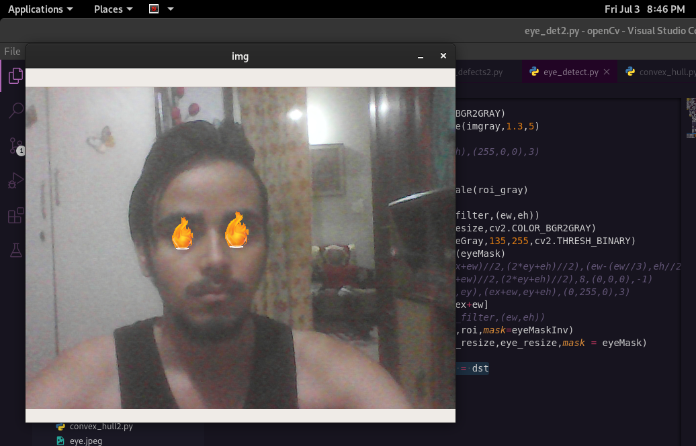

# Eye-Filter-using-python-opencv-
<h1>Simple Eye Filter effect using python ,similar to the effects in instagram,snapchat..</h1> 
<h2>How to run</h2> 

pip3 install -r requirements.txt
 

python3 eye_filter.py
 
<h2>Adjustments</h2> 

Place your webcam in proper position to get right brightness, to see the effects clearly
 

You can change the effect by replacing the png image as per your choice for more effects
 
<h2>Screenshort</h2> 

